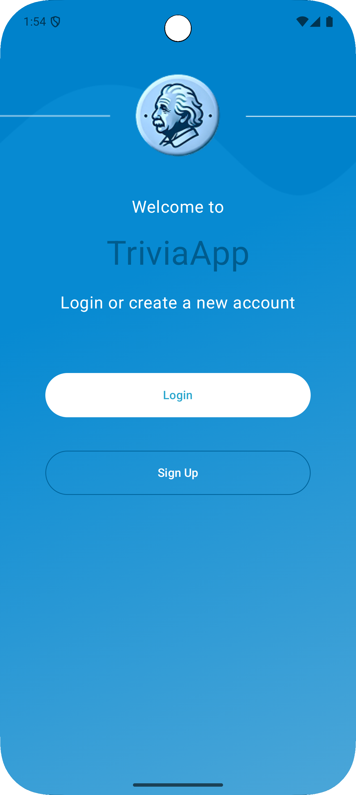
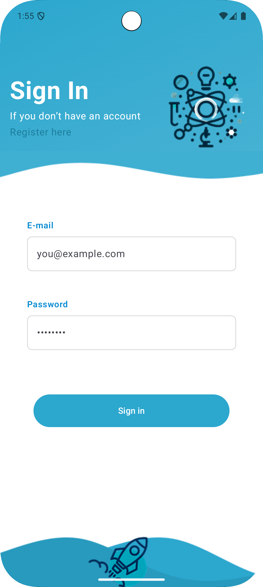
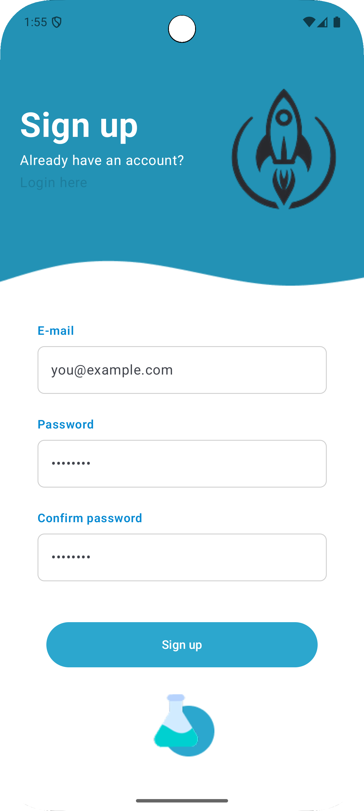
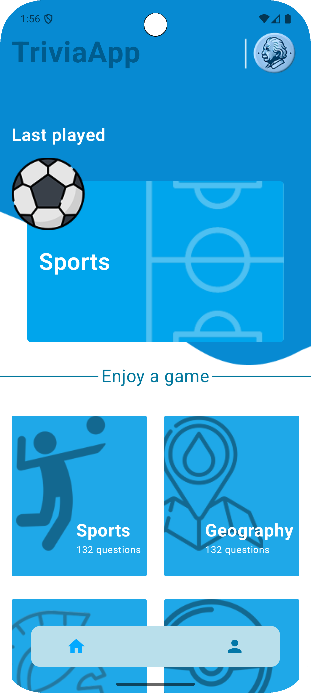
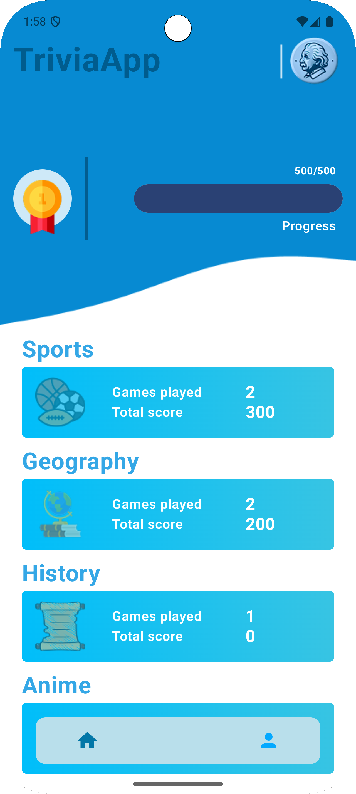
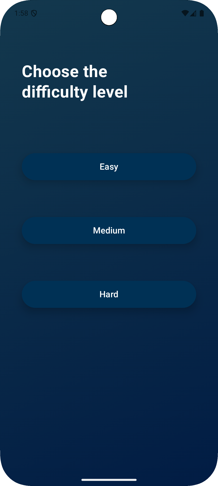
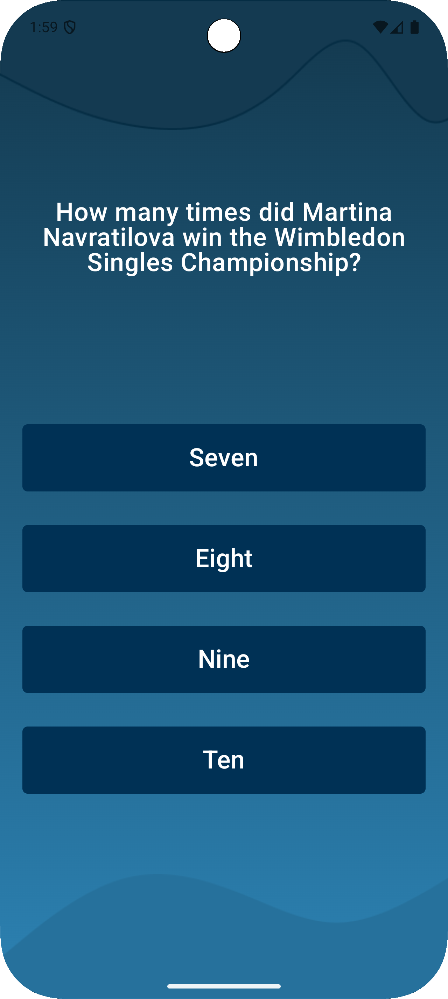
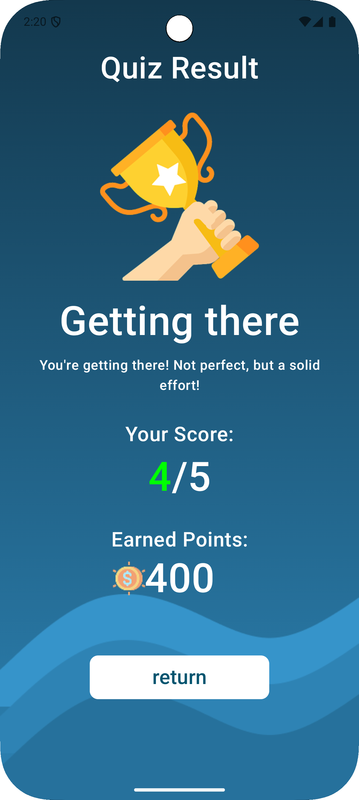

# TriviaApp

**TriviaApp** is a simple quiz app I built to play trivia by categories, track progress, and store your stats in the cloud. It uses **Open Trivia DB** for questions and **Firebase** to persist your progress and last played category.

It’s basically a project to make it easy (and fun) to answer questions without overcomplicating things.

## Features

- **Welcome Screen:**  
  A friendly intro with quick access to authentication.

- **Authentication (Login & Sign up):**  
  Email/password auth using Firebase.

- **Home:**  
  Shows your **Last played** card and the list of categories to start a new game.

- **Difficulty Picker:**  
  Choose **Easy**, **Medium** or **Hard** before starting.

- **Question Screen:**  
  Multiple choice questions, score calculation and flow control.

- **Result Screen:**  
  Shows your score, earned points and a short feedback message.

- **Progress Screen:**  
  Aggregated stats per category (games played, total score), points, progress bar and medal.

---

## Screenshots

| Welcome | Login | Sign up |
|--------|-------|---------|
|  |  |  |

| Home | Progress | Difficulty |
|------|----------|------------|
|  |  |  |

| Question | Result |
|----------|--------|
|  |  |

## 🛠️ Technologies Used

- **Kotlin + Jetpack Compose**: declarative UI.
- **MVVM + StateFlow**: predictable state management.
- **Coroutines**: async work without blocking the UI.
- **Retrofit**: HTTP client to call the trivia API.
- **Hilt (DI)**: dependency injection for repositories/viewmodels.
- **Firebase Auth & Firestore**: login and persistence of stats/last played.
- **Unit tests**: `kotlinx-coroutines-test`, fakes for repositories.

## Getting Started

To run TriviaApp locally:

1. **Clone the repository:**

```bash
git clone https://github.com/AllanAviana/TriviaApp-Android
